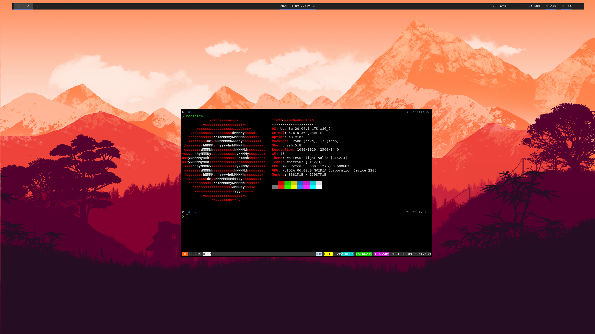
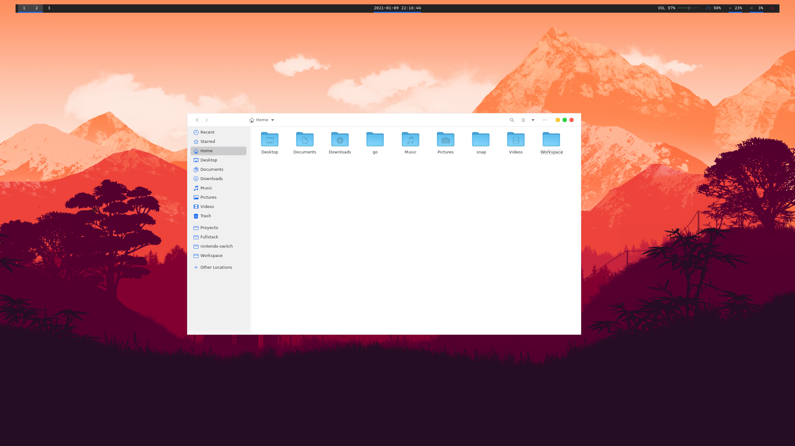
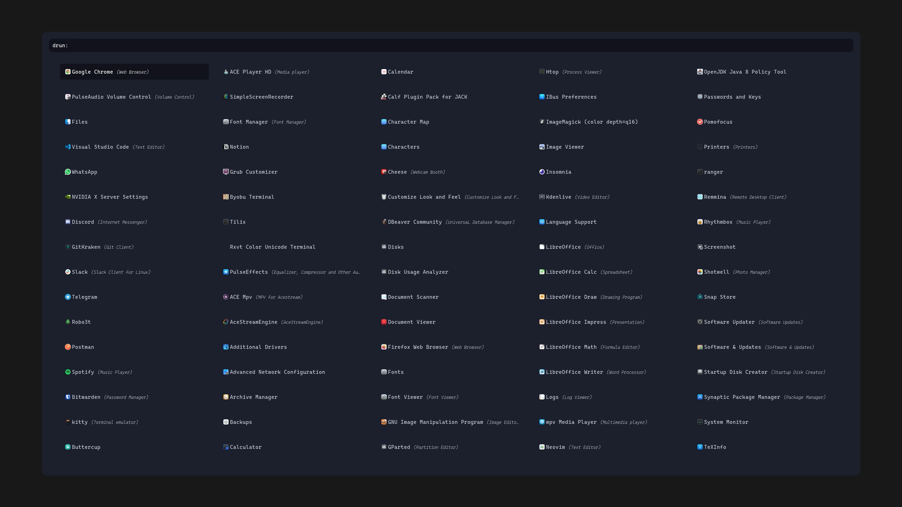
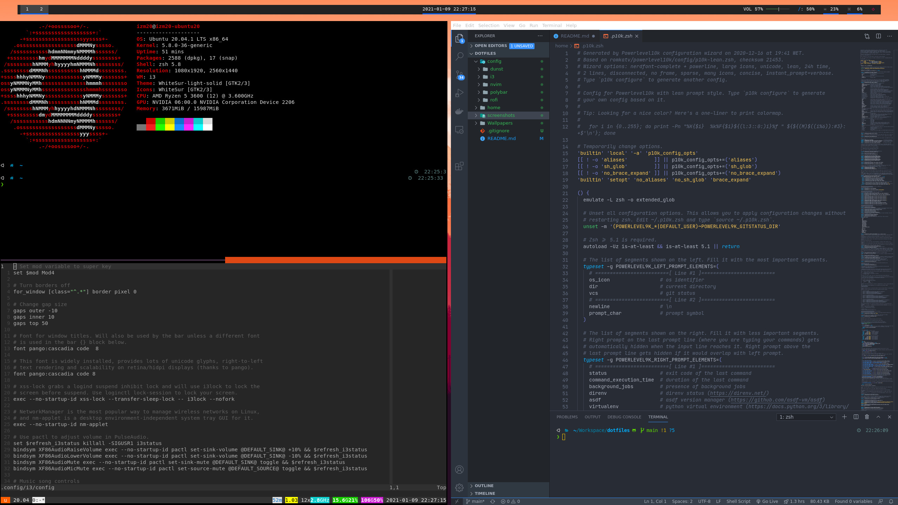

# ⚙️ izm20/dotfiles

## About

----
My dotfile organization repository! Contains config files for my current i3/Ubuntu setup. This is currently working in **Ubuntu 20.04**.

## Apps

----

- WM: [i3-gaps](https://github.com/Airblader/i3)
- Status bar: [Polybar](https://github.com/polybar/polybar)
- Notifications: [Dunst](https://github.com/dunst-project/dunst)
- Launcher: [Rofi](https://github.com/Davatorium/rofi)
- Terminal: [Kitty](https://sw.kovidgoyal.net/kitty/)
- Shell: [Zsh](https://www.zsh.org/) - [powerlevel10k](https://github.com/romkatv/powerlevel10k)
- Multiplexer: [Byobu](https://www.byobu.org/)
- File Manager: [Nautilus](https://www.guia-ubuntu.com/index.php/Nautilus)
- GTK Theme: [WhiteSur-light-solid](https://www.opendesktop.org/s/Gnome/p/1403328/)
- Icons: [WhiteSur](https://www.pling.com/p/1405756/)
- Cursor: [McMojave-cursors](https://www.pling.com/p/1355701/)

## Screenshots

----

  
